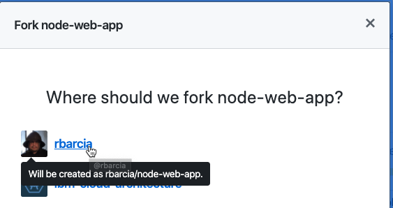
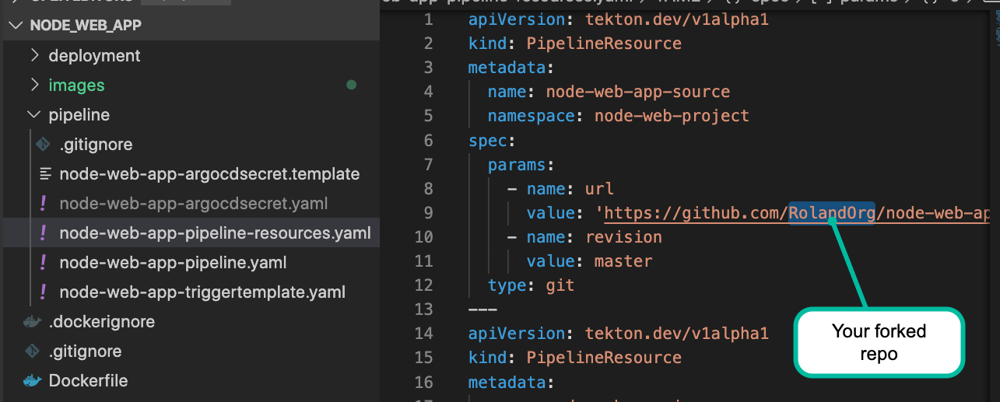
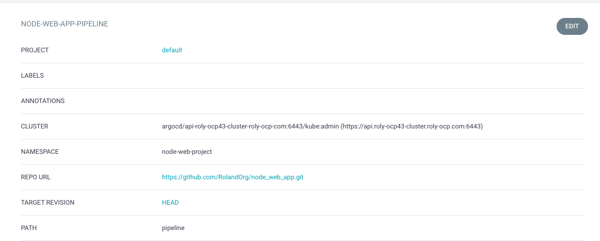

# GitOps with Tekton and ArgoCD
### Simple Node JS App Soup to Nuts: From DeskTop Docker to OpenShift Cluster

This is a simple tutorial that helped me get an understanding of Tekton and ArgoCD.  

#### Create a Fork of this Repo for your own fun.


1. Since you are running a GitOps Example, you want to create a fork of this repo into your own git-repo


2. Select your user 



3. You want to create a Clone of your new repo
```
git clone https://github.com/<your-user>/node_web_app.git

cd node_web_app
```

#### Run Node App and Test Locally with Docker or Podman 

The Node Applicaiton is created following this tutorial simulating how a new user might learn to containerize a Node App.  
[Dockerizing a Node.js web app](https://nodejs.org/fr/docs/guides/nodejs-docker-webapp/)

1. To run the applicaiton locally, [Install Docker Desktop](https://www.docker.com/products/docker-desktop) or you could use [podman](https://podman.io/) on Linux (This assumes you use podman CLI instead of docker.  Substitute docker <command> with podman <command>)

2. You can run the app locally if you have [node](https://nodejs.org/en/) installed

```
npm install 
node server.js

```


3. Since you have the code, docker build


```
docker build -t <your username>/node-web-app .
```
If you want to use podman locally, follow directions [here](https://developers.redhat.com/blog/2019/09/13/develop-with-node-js-in-a-container-on-red-hat-enterprise-linux/) to build with buildah.


4. Run the applicaiton in a container.
```
docker run -p 49160:8080 -d <your username>/node-web-app

```

5. Check that the container is running.
```
docker ps
```

6. Test the Application 

```
curl -i localhost:49160

```
#### Change Pipeline Resource to your git repo.

This change is required to run a build from the console without a Trigger Event.  



#### Using OpenShift 4.3 as my Kubernetes Cluster 

You need your own 4.3 OpenShift Cluster.  Here are some options.  

I [installed OpenShift 4.3 into AWS following these instructions](https://docs.openshift.com/container-platform/4.3/installing/installing_aws/installing-aws-account.html).

You could use [Code Ready Containers](https://cloud.redhat.com/openshift/install/crc/installer-provisioned?intcmp=7013a000002CtetAAC) Locally.  

This tutorial can work also on any Kubernetes, but you have to install Tekton and use the [buildah](https://github.com/tektoncd/catalog/tree/v1beta1/buildah) task.  

#### Install ArgoCD Operator into OpenShift 

For this tutorial I followed [the Console Install](https://argocd-operator.readthedocs.io/en/latest/install/openshift/) using the Argo CD Operator on OpenShift.  

#### Install OpenShift Pipeline Operator 

For this tutorial I follwed the instructions to install the [OpenShift Pipeline Operator](https://openshift.github.io/pipelines-docs/docs/0.10.5/assembly_installing-pipelines.html).

#### Install the Argo CD Tekton Task into the argocd namespace

[Argo CD Tekton Task](https://github.com/tektoncd/catalog/tree/v1beta1/argocd)

#### Create OCP Project 
Name the Project -> node-web-project
OR Change all namespaces in the YAML File to match your project 

#### Allow Pipeline to access registry for build and deploy
```
oc policy add-role-to-user registry-editor builder

oc policy add-role-to-user registry-editor deployer
```

#### Create App ArgoCD to point to Git Repo 

You need to create 2 applications in Argo.  One to synchronize the Tekton Pipleines and the other for the web app itself.  




Create Webhook in Git.  

#### Sync Repo 
Resources should be created but the deployments fail to start.  


#### Run Pipeline 

#### Look at app 


